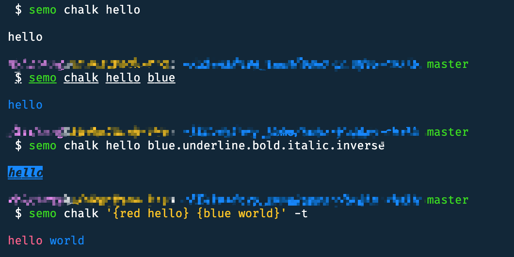

# 插件 semo-plugin-chalk 发布

新开发了一个 `Semo` 插件，可以一行命令输出一个带颜色的文字，基于流行的 npm 包 `chalk`，以下是基本用法：


安装 Semo
-------

首先，当然是需要大家安装 `Semo`，推荐全局安装。

```
npm i -g @semo/cli
```

如果不安装，通过 npx @semo/cli 来调用后面的命令也是可以的，当然这种是不推荐的。

安装插件
----

插件也推荐全局安装，因为这不属于业务依赖

```
npm i -g semo-plugin-chalk
```

当然，受益于 `semo run` 命令提供的机制，这里也可以不手动安装插件，而是使用 `semo run chalk` 来调用。本文仍然假设大家安装了插件，这样命令更短一些。

使用方法
----

### 查看颜色示例：

有时候我们记不住什么关键字代表什么颜色，通过 `--demo` 参数可以看到:


```
semo chalk --demo
```

### 直接输出默认文本

```
semo chalk hello
```

### 给文本添加颜色

```
semo chalk hello blue
```

### 给文本添加颜色，下划线，粗体，倾斜，反色

```
semo chalk hello blue.underline.bold.italic.inverse
```

### 同一行文本不同颜色，需要用到 `chalk` 的标签模板语法

```
semo chalk '{red hello} {blue world}' -t
```

`-t` 或 `--template` 参数表明开启模板解析，否则默认是直接输出。

以上命令的效果如下：



小结
--

以上就是这个 `Semo` 插件的用法，这个插件开发过程一共就花了不到一个小时，因为首先核心特性都是 `chalk` 提供的，其次，Semo 提供了 插件开发的模板，比如，我是这样起步的：

```
semo create semo-plugin-chalk --template=plugin
```

所以，这里主要还是向大家展示经过不断优化后，`Semo` 这个项目的一点点能力，同时，这个项目有一些性能问题，还需要大家给予指点。

彩蛋
--

假设大家环境里只安装了 node, npm, npx 这样的基本命令，仍然可以一行命令执行本文中的命令，示例：

```
npx @semo/cli run chalk -- hello blue.underline.bold.italic.inverse
```
